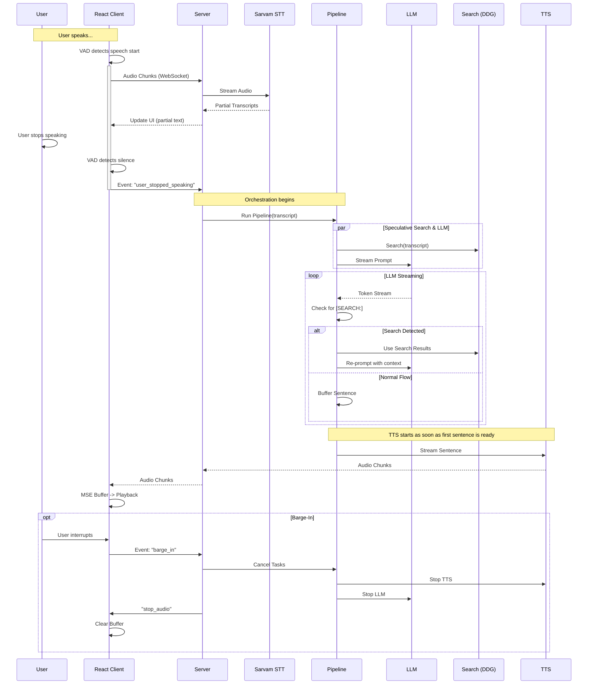

# Baatein Voice Agent Architecture

This document details the architecture of the Baatein Voice Agent, a real-time conversational AI system built with React and Python.

## 1. High-Level Overview

The system consists of a **React Frontend** (for capture/playback) and a **Python Backend** (for orchestration/AI). Communication happens over a **WebSocket** connection.

```mermaid
graph TD
    Client[React Client (Browser)] <-->|WebSocket (Audio/JSON)| Server[FastAPI Server]
    
    subgraph "Frontend (ui/)"
        Mic[Microphone] --> VAD[VAD Logic]
        VAD --> WS_Client[WebSocket Client]
        WS_Client --> Player[MSE Audio Player]
        Orb[Voice Orb UI]
    end

    subgraph "Backend (app/)"
        Server --> Orchestrator[Pipeline Orchestrator]
        Orchestrator --> STT_Service[STT Service]
        Orchestrator --> LLM_Service[LLM Service]
        Orchestrator --> Search_Service[Search Tool]
        Orchestrator --> TTS_Service[TTS Service]
    end

    subgraph "External APIs"
        STT_Service --> Sarvam_STT[Sarvam STT (Saaras)]
        LLM_Service --> Sarvam_LLM[Sarvam LLM]
        TTS_Service --> Sarvam_TTS[Sarvam TTS (Bulbul)]
        Search_Service --> DDG[DuckDuckGo]
    end
```

## 2. Component details

### Frontend (`ui/`)
- **Technology**: React 18, TypeScript, Vite, TailwindCSS.
- **State Management**: `zustand` (stores connection status, transcripts, audio levels).
- **Core Logic**: `useVoiceAgent.ts` hook.
  - **VAD (Voice Activity Detection)**: Calculates RMS of microphone input. Detects speech start/end locally to reduce latency.
  - **MSE (Media Source Extensions)**: Streams audio chunks from the server directly to an HTML5 Audio element for low-latency playback.
  - **Barge-In**: Listens for user speech during playback. If detected, sends `barge_in` event to server and stops local playback immediately.

### Backend (`app/`)
- **Technology**: Python 3.11+, FastAPI, Uvicorn, AsyncIO.
- **Server (`server.py`)**: Handles WebSocket connections and manages the session lifecycle.
- **Pipeline (`pipeline.py`)**: orchestrates the flow.
  - Runs **Speculative Search** in parallel with LLM generation.
  - Streams LLM tokens and detects `[SEARCH: query]` commands.
  - Buffers tokens into sentences for TTS.
- **Services**:
  - `stt.py`: Manages WebSocket connection to Sarvam STT.
  - `llm.py`: Streams tokens from Sarvam LLM via HTTP SSE.
  - `tts.py`: Streams audio from Sarvam TTS via WebSocket.

## 3. Detailed Data Flow

The following sequence diagram illustrates the lifecycle of a single turn (User speaks -> AI responds).



## 4. Key Features

### 4.1. Client-Side VAD
Instead of sending all audio to the server to detect silence (which adds latency), the React client instantiates an `AudioContext` and an `AnalyserNode` (or `ScriptProcessor`). It calculates the Root Mean Square (RMS) amplitude of the input.
- **Speech Threshold**: RMS > 0.03
- **Silence Duration**: 2000ms (configurable)
- **Result**: The server only receives a commitment to "end of turn" when the client is sure, reducing false triggers.

### 4.2. Speculative Search
To minimize latency, the backend starts a DuckDuckGo search **simultaneously** with the LLM request.
- If the LLM generates a `[SEARCH: ...]` command, we check if the speculative search query matches (using Jaccard similarity or embedding distance).
- If it matches, we use the already-fetched results instantly.
- If not, we perform a fresh search.

### 4.3. Full-Duplex Barge-In
The system allows the user to interrupt the AI at any time.
- The client monitors the microphone even while playing audio.
- If speech is detected (RMS > threshold) during playback, a `barge_in` event is sent.
- The server cancels all running asyncio tasks (LLM generation, TTS streaming) to free up resources and stop the response immediately.
- The client clears its audio buffer and resets to `listening` state.
